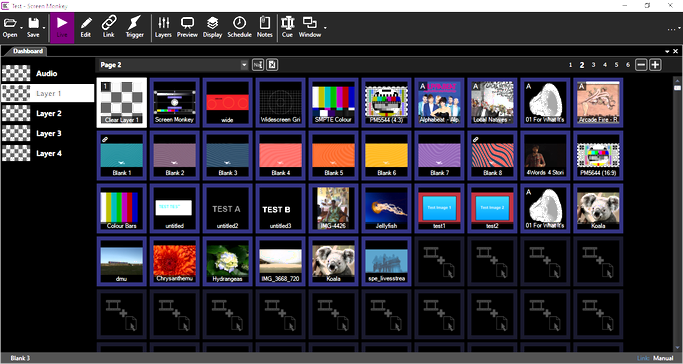
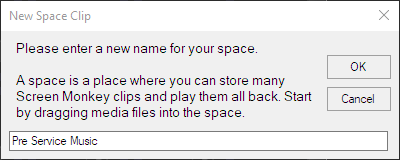
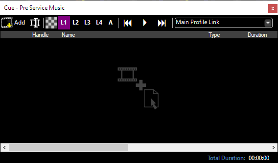

 
# Cue List / Space Clip

A Cue List (Space Clip) is a special type of clip. It is a container which allows you to store a collection of related clips in one place and play them back either automatically or manually. 

This clip may help you better organize your Screen Monkey dashboard by hiding multiple clips behind one dashboard slot. The clip is also great for creating groups of releated clips.

For example, suppose you are using Screen Monkey to manage visuals for a concert with three different groups and several members in each group. You may choose to create a space clip for each group. Inside the space clip would be all the media assets related to the group.

If you didn't use space clips, your dashboard may look like this:

That's quite a jumble of clips and you might be hard pressed to determine which clip is what when you needed it. Using space clips you are able to easily organize them by group. In this case the same clips have been divided into four space clips. The spaces have been docked in a tabbed view at the right of the dashboard.

Normally the first clip you have added to the cue list will play when you play the Space Clip. Each successive click on the Space Clip in the main dashboard advances to the next clip listed in the cue.

## Create a Space Clip
When you click an empty dashboard slot and pick the Space clip you are prompted to provide a name to identify the space.

Type a name into the textfield and click OK.

The Space clip is added to the dashboard and an empty cue window is displayed waiting for you to add clips.

There are three ways to add clips to the Cue window.

*   Clicking the blank area of the window
*   Clicking the Add icon in the window toolbar  
*   Clicking and dragging files into the window  

When you click the blank area of the Cue window or click the Add icon, Screen Monkey behaves in the same way it does when clicking an empty slot. It presents a dialog where you choose a Clip type to add. Select the Clip type and click OK.
     
Files may be dragged from Windows Explorer or you may click and drag clips from the Screen Monkey main dashboard to the Cue window.

A handy tip is that when dragging files from Windows Explorer onto an empty slot in the Main Dashboard, you may press and hold the Alt key as you click and drag. This will cause a Space Clip to be created that contains the selected files. This is a handy shortcut to creating spaces containing lots of clips.

To edit the clips within a space, click once to select them with the mouse so they are highlighted in lavender, then right-click to display the clip menu. You will have the same [clip settings](../clipSettings/clipSettings.md) as you do if the clip were on the main dashboard.

Note that Space Clips offer their own layers and the clips with the Space Clip may also be assigned to individual layers. [Learn more about Layers](../layers.md).

## Use a Space Clip in a show

Before any of the items listed in a Space clip will appear you must click the Space Clip in the main dashboard to play it. The clip listed first in the Cue dialog will then appear on the screen or begin playing.

After playing the Space Clip in the Main Dashboard, the Cue dialog should be opened. You may wish to open the dialog before actually playing the Space Clip.

To open the Cue dialog, Click the Space Clip using the middle mouse button or right-click the Space Clip and choose Edit / Cue.

The live clip is highlighted in orange and this turns to yellow when the space is playing and the live clip is actually on the screen. You can change the live item by double clicking on a clip.

The Cue toolbar allows you to work with the clips that are part of the space.

Clicking the Add button opens the Create Clip dialog so you may add a new clip to the space

Clicking the Edit / Cue button opens the Cue dialog for the clip. This button only works for clips that support cueing, such as Audio or Video.

Clicking the Clear button will clear whatever layer or clip has been selected prior to clicking the button. Perhaps a clip is playing on Layer 3. To clear Layer 3, you would first click L3 to the right of the Clear button, then click the Clear button.

Clicking the layer buttons allow you to choose the Layer to act upon using the Clear button described above.

The Triangle icon starts playing the clip and when play begins the icon changes to a square. At that point it will stop playing the clip when clicked.

Clicking the Profile Selection will allow you to choose the Display Profile used by the Space Clip.